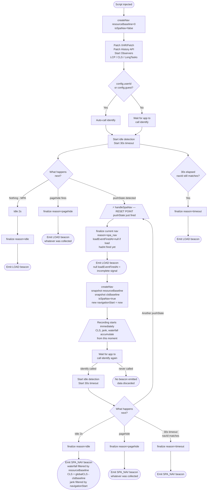

```mermaid
flowchart TD
    A([Script injected]) --> B[createNav resourceBaseline=0\nisSpaNav=false]
    B --> C[Patch XHR/Fetch\nPatch History API\nStart Observers\nLCP / CLS / LongTasks]
    C --> D{config.userId\nor config.guest?}
    D -->|Yes| E[Auto-call identify]
    D -->|No| F[Wait for app to\ncall identify]
    E --> G[Start idle detection\nStart 30s timeout]
    F --> G

    G --> H{What happens\nnext?}

    %% Normal MPA path
    H -->|Nothing - MPA| I[Idle 2s]
    I --> J[finalize reason=idle]
    J --> K([Emit LOAD beacon])

    %% Pagehide safety net
    H -->|pagehide fires| Z[finalize reason=pagehide]
    Z --> AA([Emit LOAD beacon\nwhatever was collected])

    %% 30s hard cutoff
    G --> AB{30s elapsed\nnavId still matches?}
    AB -->|Yes| AC[finalize reason=timeout]
    AC --> AD([Emit LOAD beacon])

    %% SPA nav detected - reset happens HERE at pushState moment
    H -->|pushState detected| Q
    Q[/"⚡ handleSpaNav — RESET POINT\npushState just fired"\]

    Q --> M[finalize current nav\nreason=spa_nav\nloadEventFiredAt=null if load\nhadnt fired yet]
    M --> O([Emit LOAD beacon\nnull loadEventFiredAt = incomplete signal])

    %% Immediately after emit - reset nav state
    O --> R[createNav\nsnapshot resourceBaseline\nsnapshot clsBaseline\nisSpaNav=true\nnew navigationStart = now]

    R --> R1[/"Recording starts immediately\nCLS, jank, waterfall accumulate\nfrom this moment"\]

    R1 --> U[Wait for app to\ncall identify again]
    U -->|identify called| T[Start idle detection\nStart 30s timeout]
    U -->|never called| DISCARD([No beacon emitted\ndata discarded])

    T --> V{What happens\nnext?}
    V -->|Idle 2s| X[finalize reason=idle]
    X --> Y([Emit SPA_NAV beacon\nwaterfall filtered by resourceBaseline\nCLS = globalCLS - clsBaseline\njank filtered by navigationStart])

    V -->|Another pushState| Q
    V -->|pagehide| Z2[finalize reason=pagehide]
    Z2 --> AA2([Emit SPA_NAV beacon\nwhatever was collected])
    V -->|30s timeout\nnavId matches| AC2[finalize reason=timeout]
    AC2 --> AD2([Emit SPA_NAV beacon])
```
